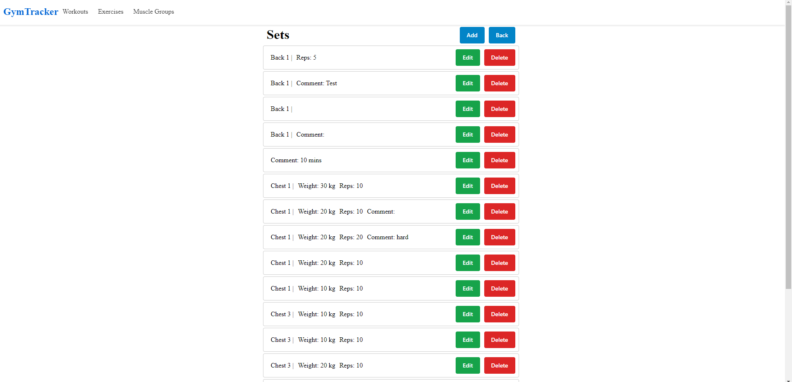

# Typescript Express + React Web Gym Tracker 💪

Welcome to the **Web Gym Tracker**, a full-stack application built with Express.js and React to help fitness enthusiasts log workouts and track progress over time.

---

## 🚀 Features

* **Workout Logging**: Create, read, update, and delete workouts, muscle groups, exercises and workout sets with ease.
* **RESTful API**: Well-structured endpoints for seamless front-end/back-end communication.
* **TypeScript**: Entire project written in TypeScript with strict mode for enhanced type safety and maintainability.

---

## 🛠️ Tech Stack

| Layer        | Technology              |
| ------------ | ----------------------- |
| **Backend**  | Node.js, Express.js     |
| **Database** | MySQL                   |
| **Frontend** | React                   |
| **Styling**  | Shoelace, SCSS          |

---

## 📸 Demo



---

## 💾 Installation

1. **Clone the repo**

   ```bash
   gh repo clone ValsCodes/Express-React-Gym-Tracker
   ```

2. **Install dependencies**

   ```bash
   # Server
   cd backend && npm install

   # Client
   cd ../frontend && npm install
   ```

3. **DB Set up**
   * Use the sql file in **_db** in order to create the database
   * Add your connection string in the file **..backend/models/Database.ts**
---

4. **Run the application**
# From project root
  * Run Frontend 
   ```bash
   cd .\frontend\
   npm run start
   ```
  * Run Backend

  ```bash
   cd .\backend\
   npm run dev
   ```
---

## 📦 Usage

* Navigate to the **Muscle Groups** page and add your own muscle groups.
* Navigate to the **Exercise** page and add your own exercises.
* Navigate to the **Workouts** page to create a workouts.
* Double click any of your workouts to view and add your workout sets.

* Edit or delete entries as needed.

---

## 🔌 API Endpoints

* `GET /workout` - Retrieve all workouts
* `GET /workout/:id` - Retrieve workout by Id
* `GET /workout/:id/working-sets` - Retrieve all working sets for workout
* `POST /workout` - Create a new workout entry
* `PUT /workout/:id` - Update an existing workout
* `DELETE /workout/:id` - Remove a workout entry
  
* `GET /muscle-group` - Retrieve all muscle groups
* `GET /muscle-group/:id` - Retrieve muscle group by Id
* `POST /muscle-group` - Create a new muscle group entry
* `PUT /muscle-group/:id` - Update an existing muscle group
* `DELETE /muscle-group/:id` - Remove a muscle group entry
  
* `GET /exercise` - Retrieve all exercises
* `GET /exercise/:id` - Retrieve exercise by Id
* `POST /exercise` - Create a new exercise entry
* `PUT /exercise/:id` - Update an existing exercise
* `DELETE /exercise/:id` - Remove a exercise entry
  
* `GET /working-set` - Retrieve all working sets
* `GET /working-set/:id` - Retrieve working set by Id
* `POST /working-set` - Create a new working set entry
* `PUT /working-set/:id` - Update an working set exercise
* `DELETE /working-set/:id` - Remove a working set entry

---

Happy lifting! 💪
