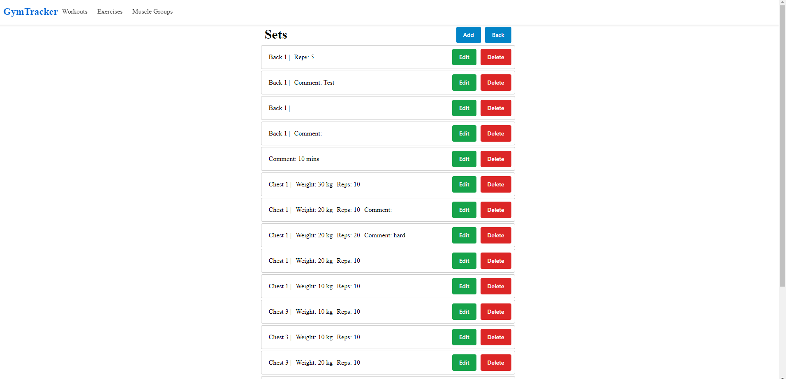

# TypeScript Express + React Gym Tracker 💪

A full-stack gym tracking app where you can manage muscle groups, exercises, workouts, and per-workout working sets.

This repository contains:
- **Express + TypeScript API** (`/backend`)
- **React + Vite + TypeScript client** (`/frontend`)
- **MySQL schema + seed data** (`/_db/db_gym_tracker2.sql`)

---

## ✨ What this app does

- Create, edit, and delete **muscle groups**
- Create, edit, and delete **exercises** linked to muscle groups
- Create, edit, and delete **workouts**
- Add **working sets** (reps, weight, comments) to a workout
- Reorder list-style items in the UI with drag-and-drop

---

## 🧱 Tech stack

| Layer | Stack |
|---|---|
| Frontend | React 19, TypeScript, Vite, Sass, Shoelace |
| Backend | Node.js, Express 5, TypeScript |
| Database | MySQL (via `mysql2/promise`) |
| Tooling | ESLint, TypeScript compiler, Nodemon |

---

## 📸 Demo



---

## 📁 Project structure

```text
.
├── backend/                # Express API
│   ├── controllers/        # Route handlers (business orchestration)
│   ├── models/             # DB access layer
│   ├── routes/             # API endpoints
│   ├── common/             # validators, mappers, middleware, types
│   └── index.ts            # Server entrypoint (port 3001)
├── frontend/               # React app (Vite)
│   ├── src/pages/          # Feature screens (Workout, Exercise, etc.)
│   ├── src/components/     # Reusable UI/form components
│   ├── src/services/       # API request helpers
│   └── vite.config.ts      # Dev proxy to backend
└── _db/
    └── db_gym_tracker2.sql # SQL schema + seed data
```

---

## ✅ Prerequisites

- **Node.js** 18+
- **npm** 9+
- **MySQL** (or MariaDB) running locally

---

## ⚙️ Setup and installation

### 1) Clone repository

```bash
git clone https://github.com/ValsCodes/Express-React-Gym-Tracker.git
cd Express-React-Gym-Tracker
```

### 2) Install dependencies

```bash
cd backend && npm install
cd ../frontend && npm install
```

### 3) Create and seed the database

Import `/_db/db_gym_tracker2.sql` into your MySQL instance.

Examples:

```bash
# Option A: from CLI
mysql -u root -p < _db/db_gym_tracker2.sql

# Option B: use a GUI client (MySQL Workbench / DBeaver / phpMyAdmin)
# and run the SQL file manually.
```

### 4) Configure DB connection

Update the connection config in `backend/models/Database.ts`:

```ts
this.conn = mysql.createPool({
  host: "127.0.0.1",
  port: 3306,
  database: "db_gym_tracker2",
  user: "root",
  password: "",
});
```

> Tip: move these values to environment variables for production use.

---

## ▶️ Running the app

Open two terminals from the repository root.

### Terminal 1: backend

```bash
cd backend
npm start
```

Backend starts on `http://localhost:3001`.

### Terminal 2: frontend

```bash
cd frontend
npm run dev
```

Frontend starts on Vite's default dev URL (usually `http://localhost:5173`).

### How frontend talks to backend in development

The frontend uses relative API calls (e.g. `/workout`) and Vite proxies these to `http://localhost:3001`.

---

## 🧭 Frontend routes

- `/` → Workout manager
- `/workout` → Workout manager
- `/muscle-group` → Muscle group manager
- `/exercise` → Exercise manager
- `/workout/:id/working-set` → Working set manager for selected workout

---

## 🔌 API endpoints

### Workout
- `GET /workout` — list workouts
- `GET /workout/:id` — get one workout
- `POST /workout` — create workout
- `PUT /workout/:id` — update workout
- `DELETE /workout/:id` — delete workout
- `GET /workout/:id/working-sets` — list working sets for a workout

### Muscle Group
- `GET /muscle-group`
- `GET /muscle-group/:id`
- `POST /muscle-group`
- `PUT /muscle-group/:id`
- `DELETE /muscle-group/:id`

### Exercise
- `GET /exercise`
- `GET /exercise/:id`
- `POST /exercise`
- `PUT /exercise/:id`
- `DELETE /exercise/:id`

### Working Set
- `GET /working-set`
- `GET /working-set/:id`
- `POST /working-set`
- `PUT /working-set/:id`
- `DELETE /working-set/:id`

---

## 🗃️ Database overview

Tables included in the SQL script:
- `muscle_group`
- `exercise` (FK → `muscle_group.id`, `ON DELETE SET NULL`)
- `workout`
- `working_set` (FK → `workout.id` with `ON DELETE CASCADE`, FK → `exercise.id` with `ON DELETE SET NULL`)

This means deleting a workout removes its working sets automatically.

---

## 📜 Available scripts

### Backend (`/backend/package.json`)
- `npm start` — run API with nodemon

### Frontend (`/frontend/package.json`)
- `npm run dev` — start Vite dev server
- `npm run build` — type-check and build production assets
- `npm run lint` — run ESLint
- `npm run preview` — preview built app locally

---

## 🚀 Suggested next improvements

- Move DB credentials to `.env`
- Add centralized error-handling middleware for API responses
- Add authentication (session/JWT)
- Add tests for controllers/services (unit + integration)
- Add CI workflow for lint/build/test

---

Happy lifting and happy coding! 💪
